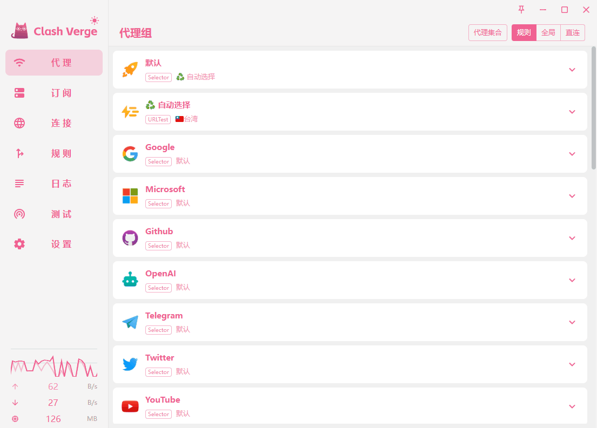
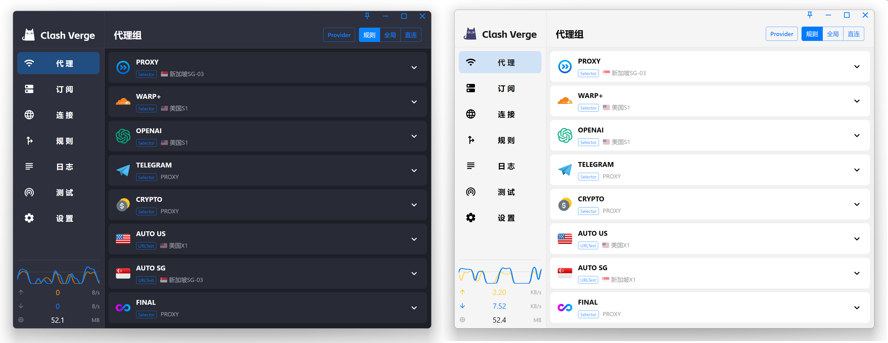
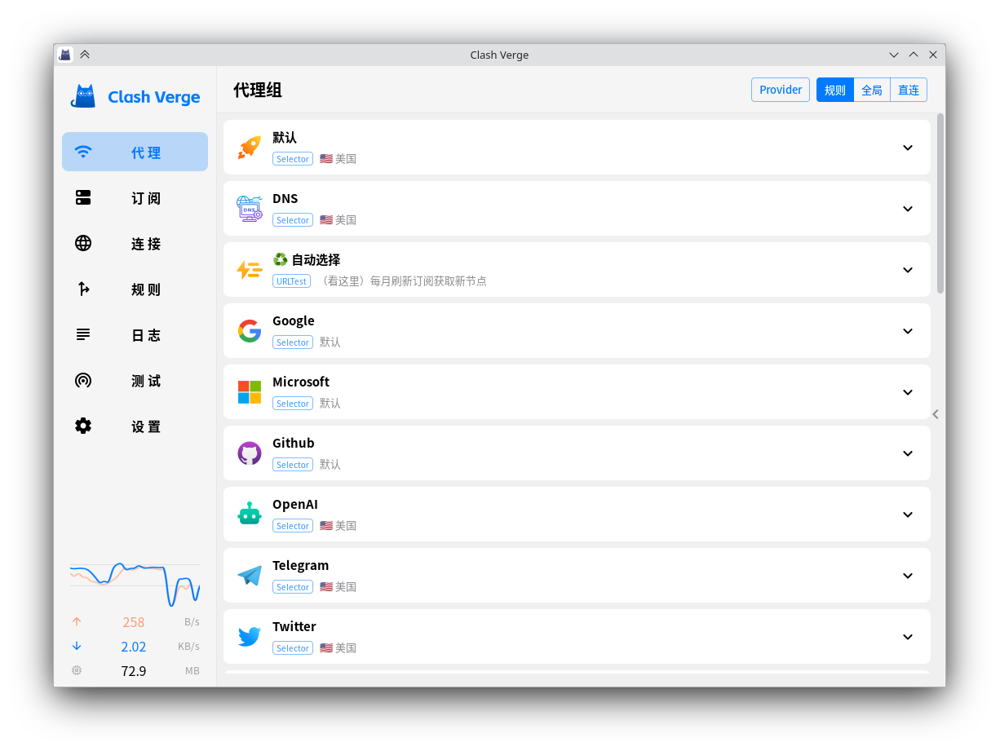
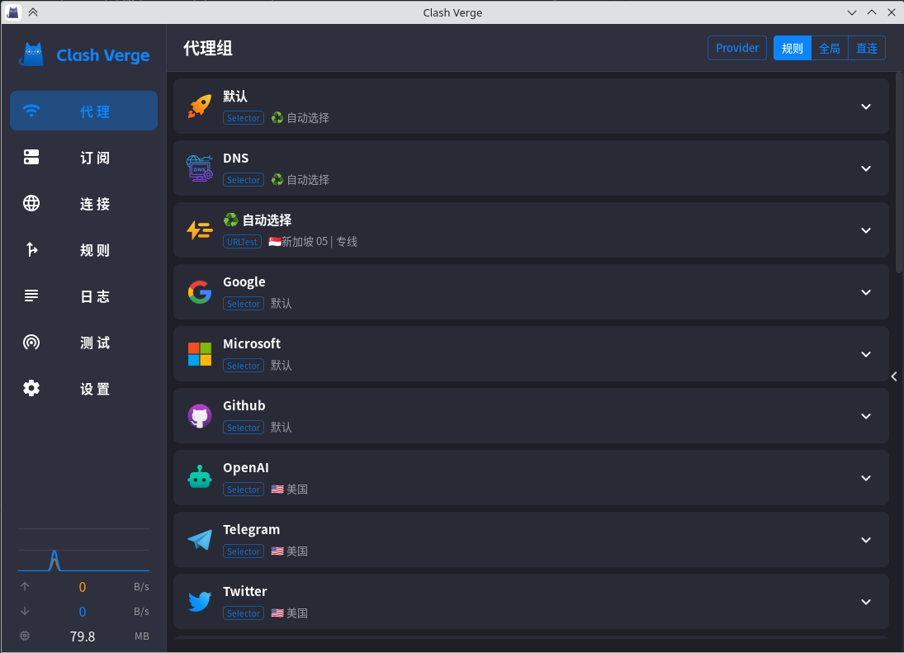
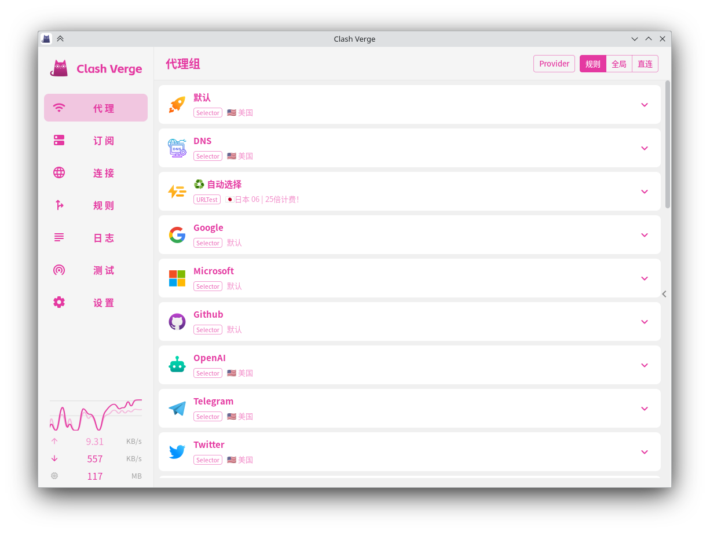
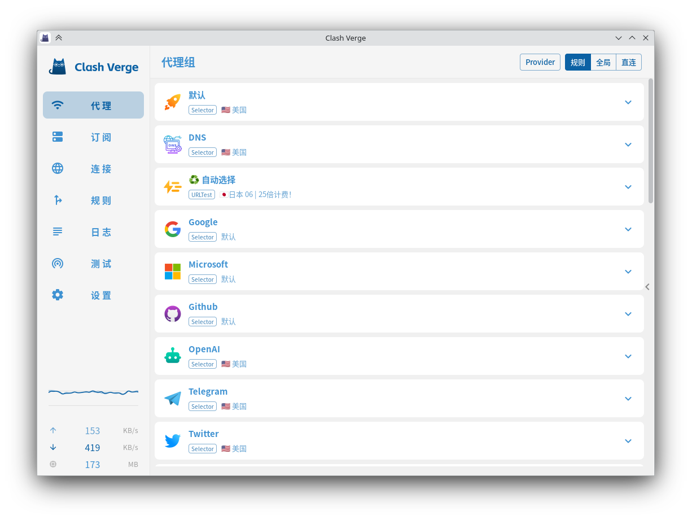

<h1 align="center">
  
  <br>
  Continuation of <a href="https://github.com/zzzgydi/clash-verge">Clash Verge</a>
  <br>
</h1>

> [!NOTE]
>
> 此仓库 fork 自 1.6.0 版本的 [clash-verge-rev](https://github.com/clash-verge-rev/clash-verge-rev)，仅仅是为了实现一些自己想要的功能，因为我基本上都在使用Linux，所以不能保证其他系统使用中出现的问题。
>
> 其他 Clash 系列桌面端软件
>
> - [Mihomo Party](https://github.com/mihomo-party-org/mihomo-party)
> - [Clash Verge Rev](https://github.com/clash-verge-rev/clash-verge-rev)
> - [Clash Nyanpasu](https://github.com/libnyanpasu/clash-nyanpasu)
> - [FlClash](https://github.com/chen08209/FlClash)

<h3 align="center">
A Clash Meta GUI based on <a href="https://github.com/tauri-apps/tauri">Tauri</a>.
</h3>

<div align="center">
  
</div>

## Preview

<!--  -->

| Light                      | Dark                     |
| -------------------------- | ------------------------ |
|  |  |

| Pink (customize)         | Blue (customize)         |
| ------------------------ | ------------------------ |
|  |  |

## Features

- Since the clash core has been removed. The project no longer maintains the clash core, but only the Clash Meta core.
- Profiles management and enhancement (by yaml and Javascript). [Doc](https://clash-verge-rev.github.io)
- Improved UI and supports custom theme color.
- Built-in support [Clash.Meta(mihomo)](https://github.com/MetaCubeX/mihomo) core.
- System proxy setting and guard.

### FAQ

Refer to [Doc FAQ Page](https://clash-verge-rev.github.io/faq/windows.html)

## Development

See [CONTRIBUTING.md](./CONTRIBUTING.md) for more details.

To run the development server, execute the following commands after all prerequisites for **Tauri** are installed:

```shell
pnpm i
pnpm check
pnpm dev
```

## Contributions

Issue and PR welcome!

## Acknowledgement

Clash Verge Self was based on or inspired by these projects and so on:

- [clash-verge-rev/clash-verge-rev](https://github.com/clash-verge-rev/clash-verge-rev): Continuation of Clash Verge - A Clash Meta GUI based on Tauri (Windows, MacOS, Linux).
- [zzzgydi/clash-verge](https://github.com/zzzgydi/clash-verge): A Clash GUI based on tauri. Supports Windows, macOS and Linux.
- [tauri-apps/tauri](https://github.com/tauri-apps/tauri): Build smaller, faster, and more secure desktop applications with a web frontend.
- [Dreamacro/clash](https://github.com/Dreamacro/clash): A rule-based tunnel in Go.
- [MetaCubeX/mihomo](https://github.com/MetaCubeX/mihomo): A rule-based tunnel in Go.
- [Fndroid/clash_for_windows_pkg](https://github.com/Fndroid/clash_for_windows_pkg): A Windows/macOS GUI based on Clash.
- [vitejs/vite](https://github.com/vitejs/vite): Next generation frontend tooling. It's fast!

## License

GPL-3.0 License. See [License here](./LICENSE) for details.
