<h1 align="center">
  
  <br>
  Clash Verge
  <br>
</h1>

<h3 align="center">
A <a href="https://github.com/Dreamacro/clash">Clash</a> GUI based on <a href="https://github.com/tauri-apps/tauri">tauri</a>.
</h3>

## Features

- Full `clash` config supported, Partial `clash premium` config supported.
- Profiles management and enhancement (by yaml and Javascript). [Doc](https://github.com/zzzgydi/clash-verge/wiki/%E4%BD%BF%E7%94%A8%E6%8C%87%E5%8D%97)
- Simple UI and supports custom theme color.
- Built-in support [Clash.Meta](https://github.com/MetaCubeX/Clash.Meta) core.
- System proxy setting and guard.

## Promotion

[狗狗加速 —— 技术流机场 Doggygo VPN](https://dg1.top)

- High-performance overseas VPN, free trial, discounted packages, unlock streaming media, the world's first to support Hysteria protocol.
- 高性能海外机场，免费试用，优惠套餐，解锁流媒体，全球首家支持 Hysteria 协议。
- 使用 Clash Verge 专属邀请链接注册送 15 天，每天 1G 流量免费试用：https://panel.dg1.top/#/register?code=sFCDayZf

<details>
<summary>Promotion Detail</summary>

- Clash Verge 专属 8 折优惠码: verge20 (仅有 500 份)
- 优惠套餐每月仅需 15.8 元，160G 流量，年付 8 折
- 海外团队，无跑路风险，高达 50% 返佣
- 集群负载均衡设计，高速专线(兼容老客户端)，极低延迟，无视晚高峰，4K 秒开
- 全球首家 Hysteria 协议机场，将在今年 10 月上线更快的 `tuic` 协议(Clash Verge 客户端最佳搭配)
- 解锁流媒体及 ChatGPT
- 官网：https://dg1.top

</details>

<br />

[EEVPN —— 海外运营机场 ※ 支持 ChatGPT](https://www.eejsq.net/#/register?code=yRr6qBO3)

- 年付低至 9.99 元，价格低，速度不减

<details>
<summary>Promotion Detail</summary>

- 中国大陆 BGP 网络接入
- IEPL 专线网络
- 最高 2500Mbps 速率可用
- 不限制在线客户端
- 解锁流媒体及 ChatGPT
- 海外运营 数据安全

</details>

## Install

Download from [release](https://github.com/zzzgydi/clash-verge/releases). Supports Windows x64, Linux x86_64 and macOS 11+

- [Windows x64](https://github.com/zzzgydi/clash-verge/releases/download/v1.3.7/Clash.Verge_1.3.7_x64_en-US.msi)
- [macOS intel](https://github.com/zzzgydi/clash-verge/releases/download/v1.3.7/Clash.Verge_1.3.7_x64.dmg)
- [macOS arm](https://github.com/zzzgydi/clash-verge/releases/download/v1.3.7/Clash.Verge_1.3.7_aarch64.dmg)
- [Linux AppImage](https://github.com/zzzgydi/clash-verge/releases/download/v1.3.7/clash-verge_1.3.7_amd64.AppImage)
- [Linux deb](https://github.com/zzzgydi/clash-verge/releases/download/v1.3.7/clash-verge_1.3.7_amd64.deb)

Or you can build it yourself. Supports Windows, Linux and macOS 10.15+

Notes: If you could not start the app on Windows, please check that you have [Webview2](https://developer.microsoft.com/en-us/microsoft-edge/webview2/#download-section) installed.

### FAQ

#### 1. **macOS** "Clash Verge" is damaged and can't be opened

open the terminal and run `sudo xattr -r -d com.apple.quarantine /Applications/Clash\ Verge.app`

## Development

You should install Rust and Nodejs, see [here](https://tauri.app/v1/guides/getting-started/prerequisites) for more details. Then install Nodejs packages.

```shell
yarn install
```

Then download the clash binary... Or you can download it from [clash premium release](https://github.com/Dreamacro/clash/releases/tag/premium) and rename it according to [tauri config](https://tauri.studio/docs/api/config/#tauri.bundle.externalBin).

```shell
# force update to latest version
# yarn run check --force

yarn run check
```

Then run

```shell
yarn dev

# run it in another way if app instance exists
yarn dev:diff
```

Or you can build it

```shell
yarn build
```

## Todos

> This keng is a little big...

## Screenshots

<div align="center">
  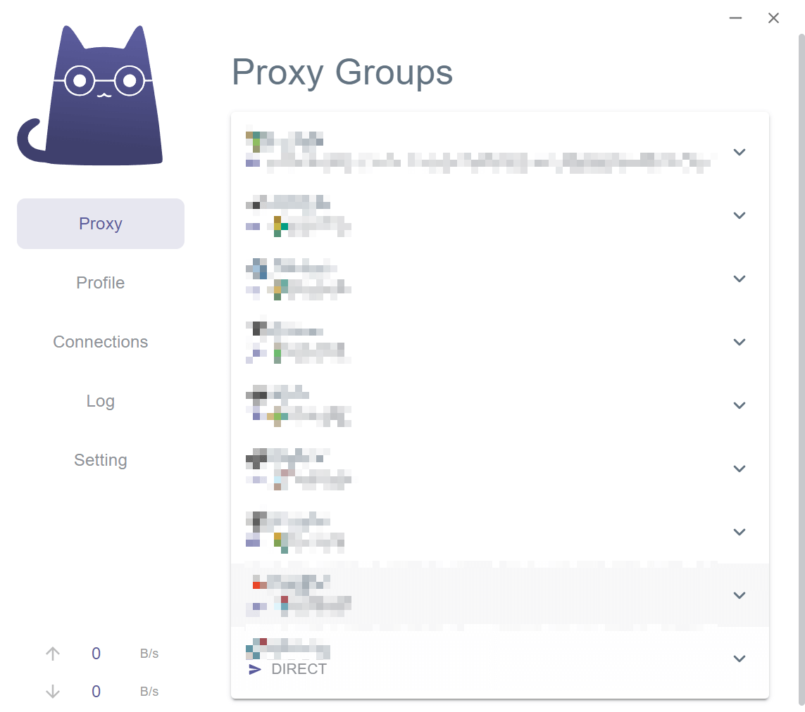
  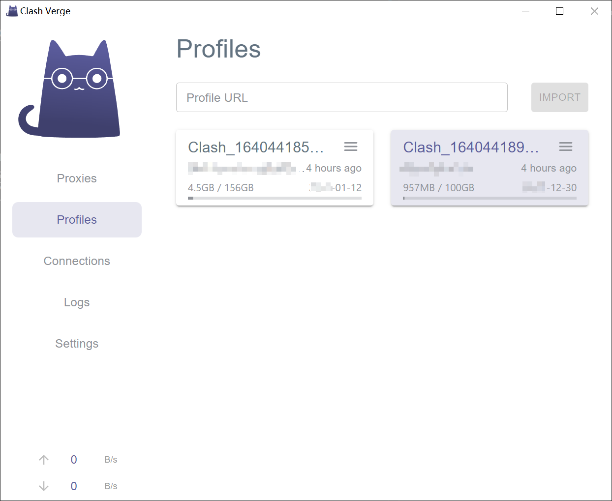
  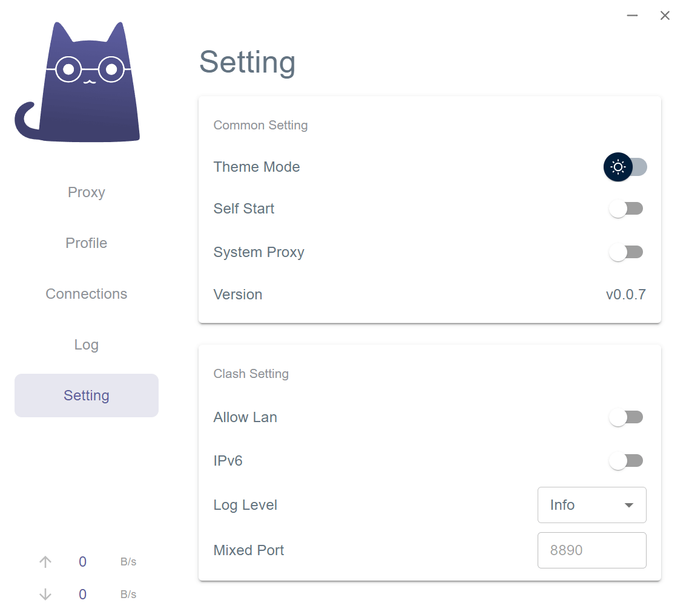
  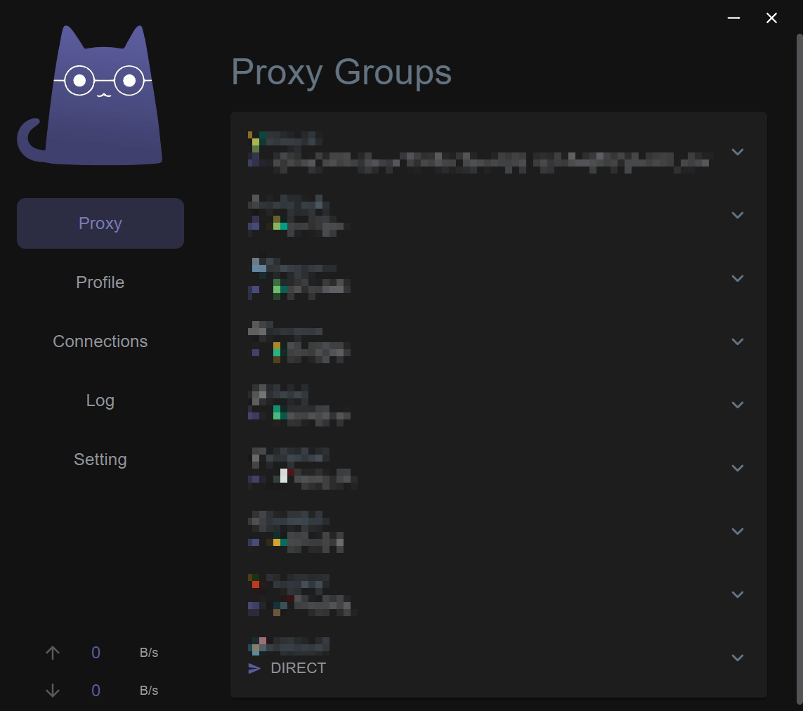
  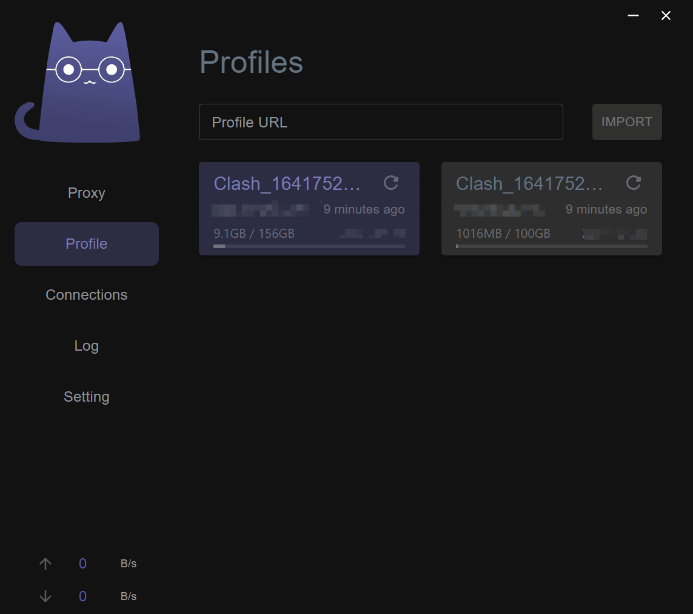
  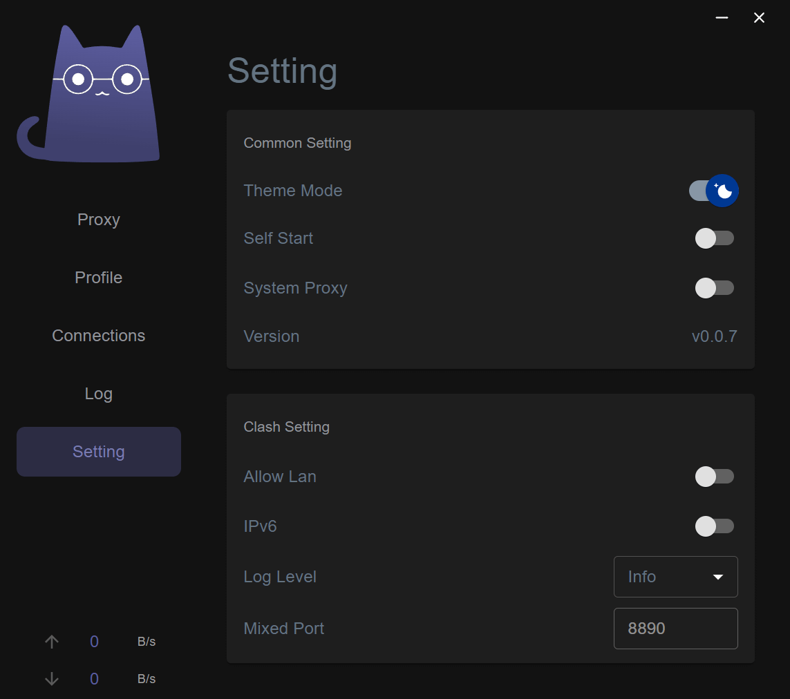
</div>

### Custom Theme

<div align="center">
  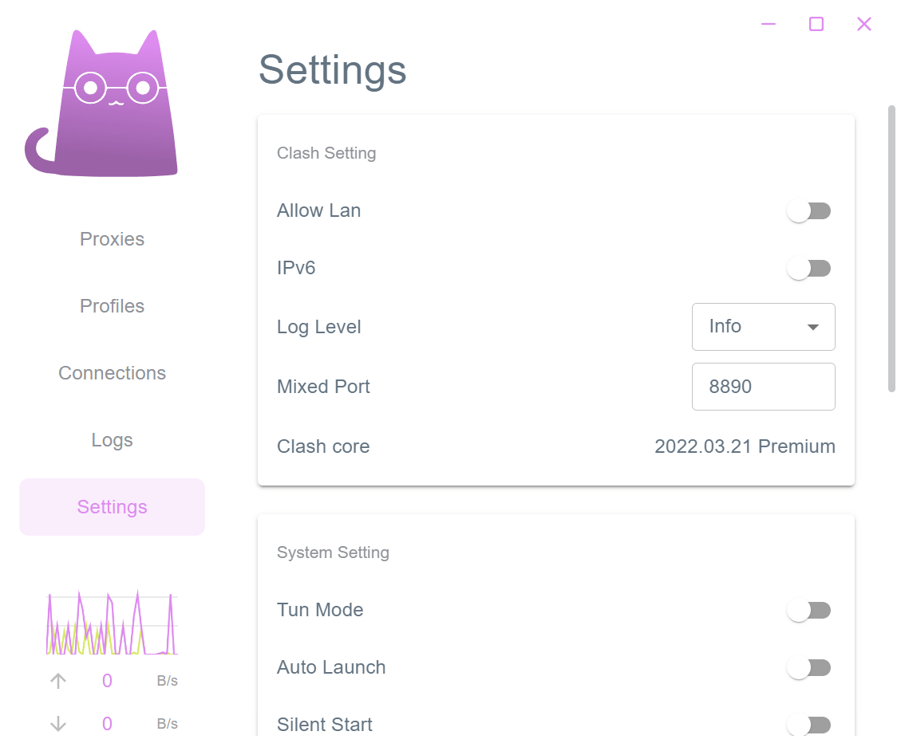
  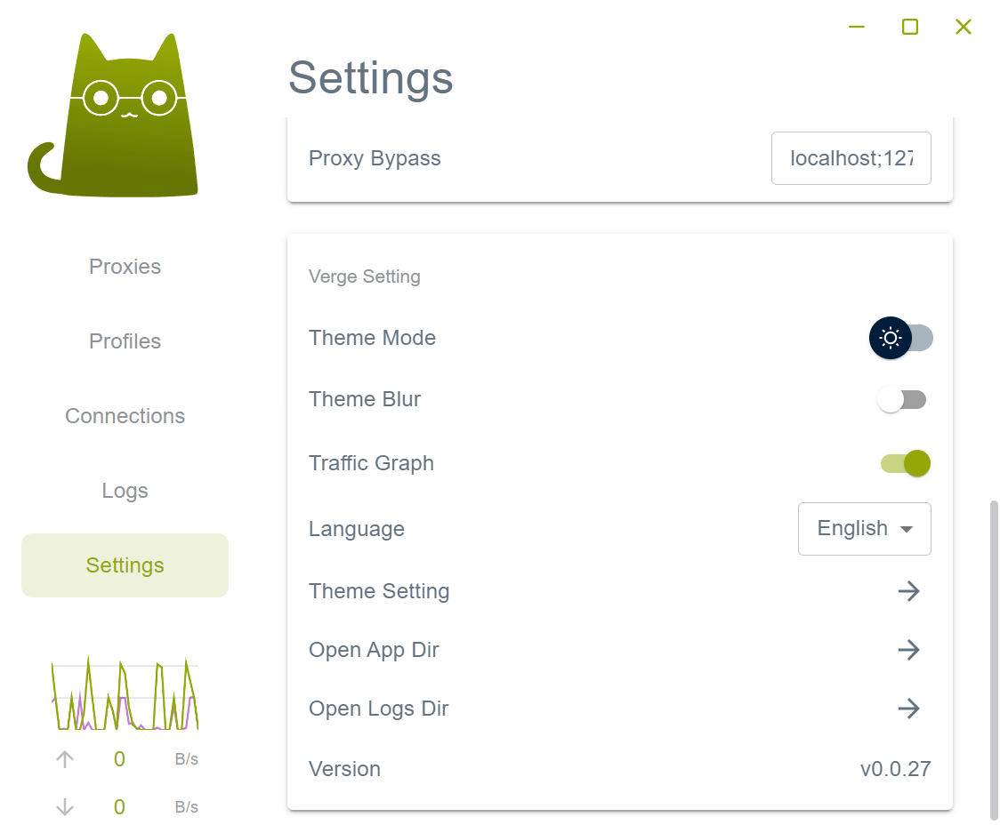
  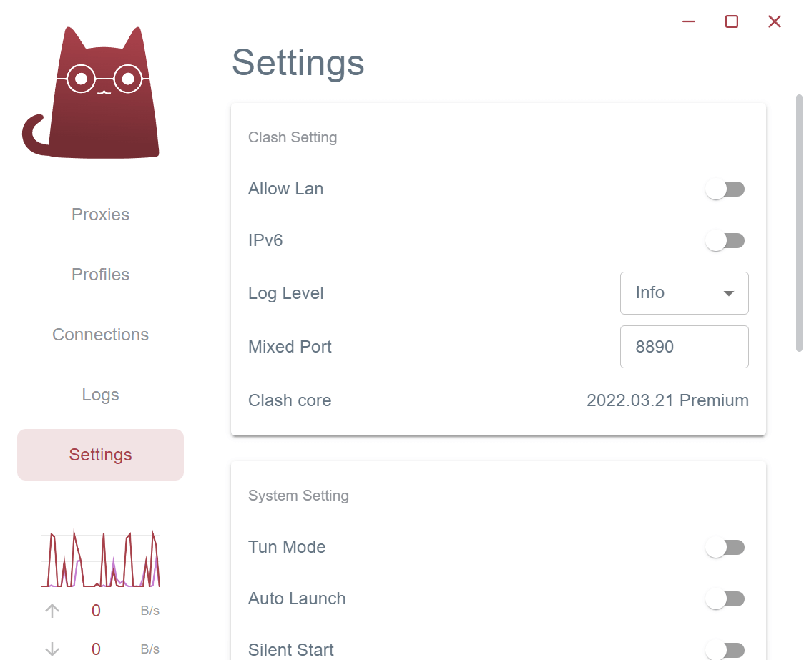
  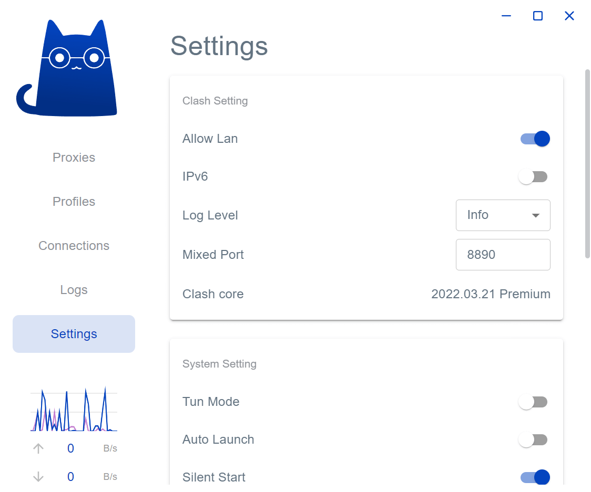
  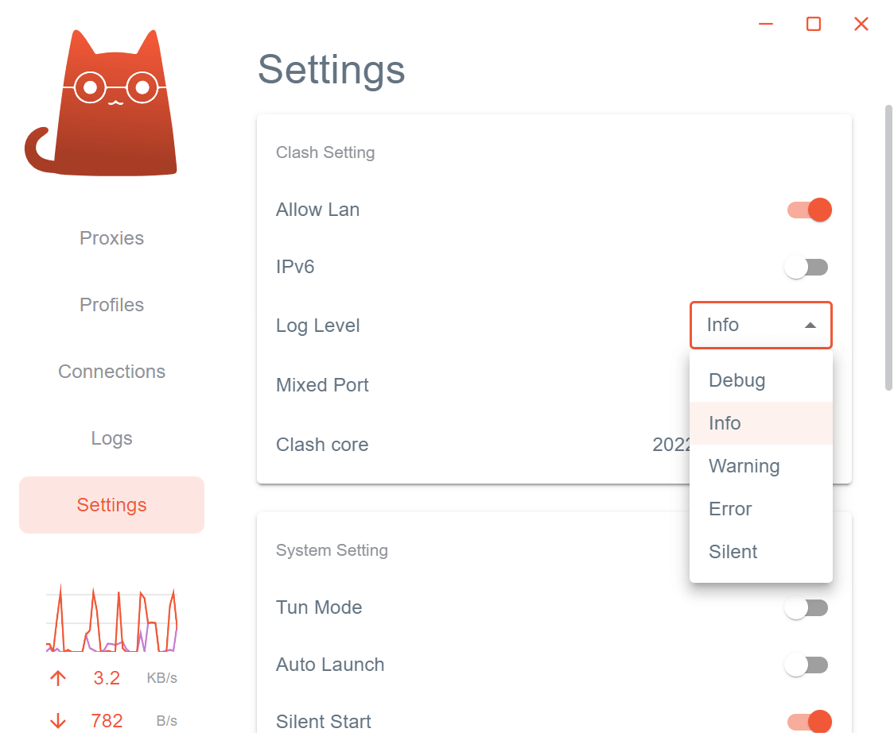
  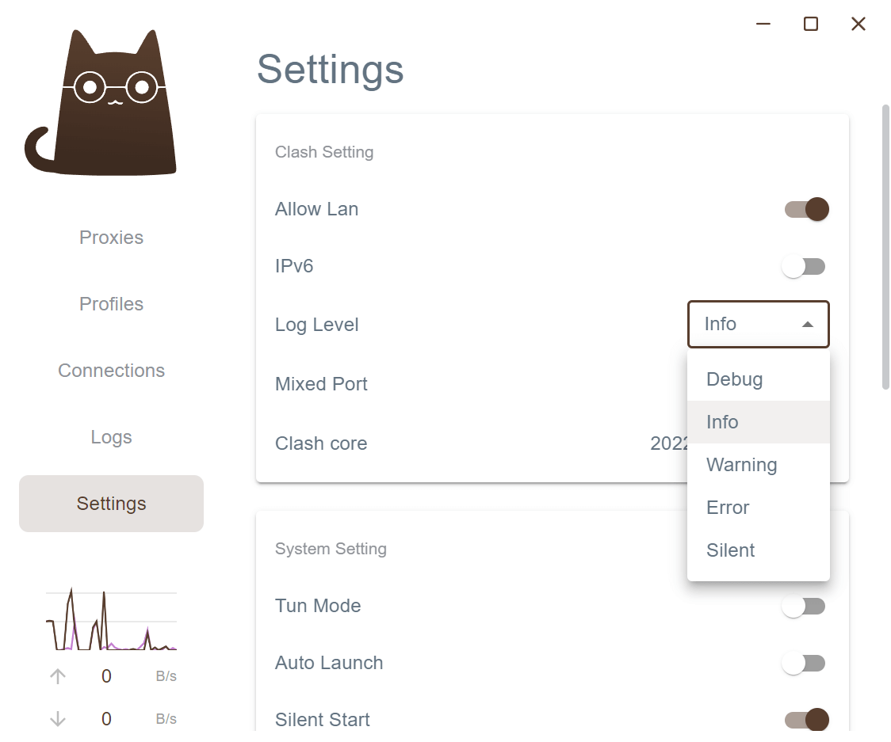
</div>

## Disclaimer

This is a learning project for Rust practice.

## Contributions

Issue and PR welcome!

## Acknowledgement

Clash Verge was based on or inspired by these projects and so on:

- [tauri-apps/tauri](https://github.com/tauri-apps/tauri): Build smaller, faster, and more secure desktop applications with a web frontend.
- [Dreamacro/clash](https://github.com/Dreamacro/clash): A rule-based tunnel in Go.
- [MetaCubeX/Clash.Meta](https://github.com/MetaCubeX/Clash.Meta): A rule-based tunnel in Go.
- [Fndroid/clash_for_windows_pkg](https://github.com/Fndroid/clash_for_windows_pkg): A Windows/macOS GUI based on Clash.
- [vitejs/vite](https://github.com/vitejs/vite): Next generation frontend tooling. It's fast!

## License

GPL-3.0 License. See [License here](./LICENSE) for details.
