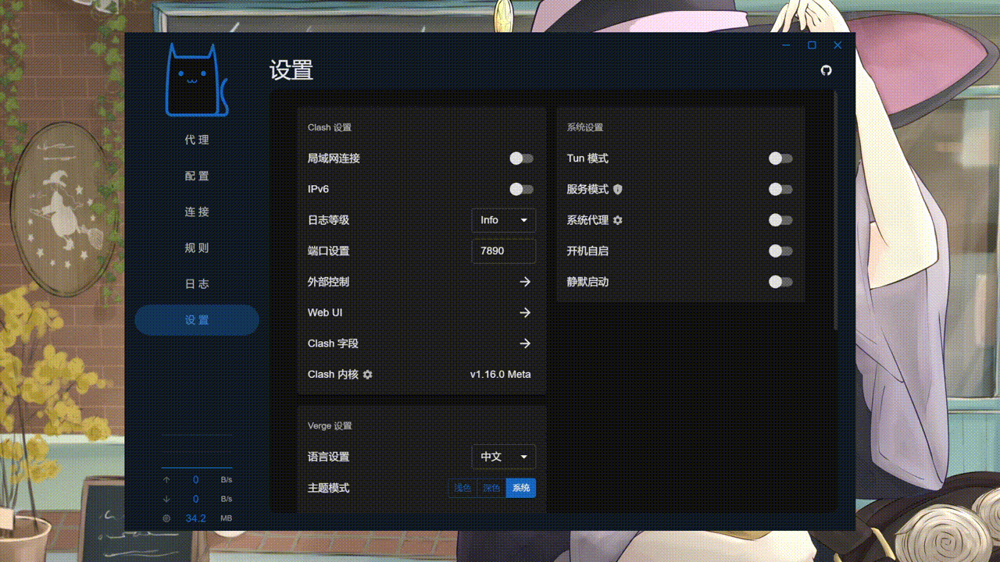

<h1 align="center">
  
  <br>
  Continuation of <a href="https://github.com/zzzgydi/clash-verge">Clash Verge</a>
  <br>
</h1>

<h3 align="center">
A Clash Meta GUI based on <a href="https://github.com/tauri-apps/tauri">Tauri</a>.
</h3>

## Features

- Since the clash core has been removed. The project no longer maintains the clash core, but only the Clash Meta core.
- Profiles management and enhancement (by yaml and Javascript). [Doc](https://github.com/Monster-Release/clash-verge-rev/wiki/%E4%BD%BF%E7%94%A8%E6%8C%87%E5%8D%97)
- Simple UI and supports custom theme color.
- Built-in support [Clash.Meta(mihomo)](https://github.com/MetaCubeX/mihomo) core.
- System proxy setting and guard.

#### TG Group: [@clash_verge_rev](https://t.me/clash_verge_rev)

## Preview



## Install

Download from [release](https://github.com/Monster-Release/clash-verge-rev/releases). Supports Windows (x64/x86), Linux (x64/arm64) and macOS 10.15+ (intel/apple).

- [Windows x64](https://github.com/Monster-Release/clash-verge-rev/releases/download/v1.4.4/Clash.Verge_1.4.4_x64-setup.exe)
- [Windows x86](https://github.com/Monster-Release/clash-verge-rev/releases/download/v1.4.4/Clash.Verge_1.4.4_x86-setup.exe)
- [Windows arm64](https://github.com/Monster-Release/clash-verge-rev/releases/download/v1.4.4/Clash.Verge_1.4.4_arm64-setup.exe)

- [macOS intel](https://github.com/Monster-Release/clash-verge-rev/releases/download/v1.4.4/Clash.Verge_1.4.4_x64.dmg)
- [macOS apple](https://github.com/Monster-Release/clash-verge-rev/releases/download/v1.4.4/Clash.Verge_1.4.4_aarch64.dmg)

- [Linux x64 AppImage](https://github.com/Monster-Release/clash-verge-rev/releases/download/v1.4.4/clash-verge_1.4.4_amd64.AppImage)
- [Linux x64 deb](https://github.com/Monster-Release/clash-verge-rev/releases/download/v1.4.4/clash-verge_1.4.4_amd64.deb)
- [Linux x86 AppImage](https://github.com/Monster-Release/clash-verge-rev/releases/download/v1.4.4/clash-verge_1.4.4_i386.AppImage)
- [Linux x86 deb](https://github.com/Monster-Release/clash-verge-rev/releases/download/v1.4.4/clash-verge_1.4.4_i386.deb)
- [Linux arm64 deb](https://github.com/Monster-Release/clash-verge-rev/releases/download/v1.4.4/clash-verge_1.4.4_arm64.deb)

Or you can build it yourself. Supports Windows, Linux and macOS 10.15+

Notes: If you could not start the app on Windows, please check that you have [Webview2](https://developer.microsoft.com/en-us/microsoft-edge/webview2/#download-section) installed.

### FAQ

#### 1. **macOS** "Clash Verge" is damaged and can't be opened

open the terminal and run `sudo xattr -r -d com.apple.quarantine /Applications/Clash\ Verge.app`

## Development

You should install Rust and Nodejs, see [here](https://tauri.app/v1/guides/getting-started/prerequisites) for more details. Then install Nodejs packages.

If you are building on Windows, please generate the public and private keys first：

```shell
tauri signer generate -w  ./tauri.key
```

Then add the public and private keys to the environment variables，for example：

mac 和 linux：

```shell
export TAURI_PRIVATE_KEY="content of the generated key"
export TAURI_KEY_PASSWORD="key password"
```

windows：

```shell
set TAURI_PRIVATE_KEY="content of the generated key"
set TAURI_KEY_PASSWORD="key password"
```

powershell:

```shell
$env:TAURI_PRIVATE_KEY="content of the generated key"
$env:TAURI_KEY_PASSWORD="key password"
```

And add Git to the system path, for example: `C:\Program Files\Git\usr\bin` (or where ever Git is installed on your computer) to your path. The rquickjs component in the project needs to use the patch tool. Of course, the patch of any tool can be used, including MinGW.

```shell
pnpm i
```

Then download the clash binary... Or you can download it from [clash meta release](https://github.com/MetaCubeX/Clash.Meta/releases) and rename it according to [tauri config](https://tauri.studio/docs/api/config/#tauri.bundle.externalBin).

```shell
# force update to latest version
# pnpm run check --force

pnpm run check
```

Then run

```shell
pnpm dev

# run it in another way if app instance exists
pnpm dev:diff
```

Or you can build it

```shell
pnpm build
```

## Todos

> This keng is a little big...

## Disclaimer

This is a learning project for Rust practice.

## Contributions

Issue and PR welcome!

## Acknowledgement

Clash Verge rev was based on or inspired by these projects and so on:

- [keiko233/clash-nyanpasu](https://github.com/keiko233/clash-nyanpasu): A Clash Verge variant.
- [zzzgydi/clash-verge](https://github.com/zzzgydi/clash-verge): A Clash GUI based on tauri. Supports Windows, macOS and Linux.
- [tauri-apps/tauri](https://github.com/tauri-apps/tauri): Build smaller, faster, and more secure desktop applications with a web frontend.
- [Dreamacro/clash](https://github.com/Dreamacro/clash): A rule-based tunnel in Go.
- [MetaCubeX/Clash.Meta](https://github.com/MetaCubeX/Clash.Meta): A rule-based tunnel in Go.
- [Fndroid/clash_for_windows_pkg](https://github.com/Fndroid/clash_for_windows_pkg): A Windows/macOS GUI based on Clash.
- [vitejs/vite](https://github.com/vitejs/vite): Next generation frontend tooling. It's fast!

## License

GPL-3.0 License. See [License here](./LICENSE) for details.
