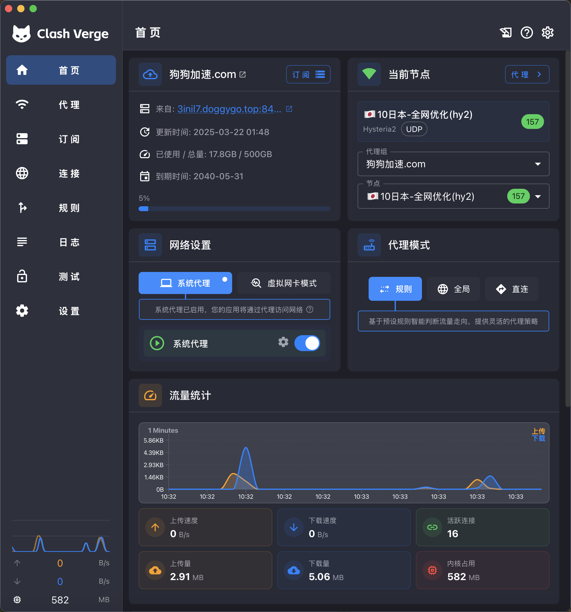
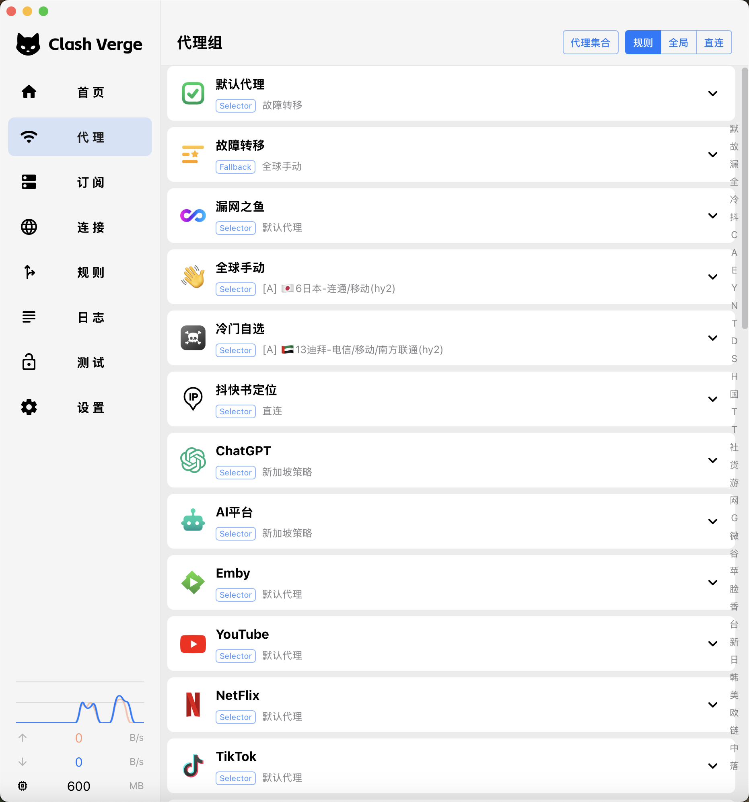

<h1 align="center">
  
  <br>
  <a href="https://github.com/zzzgydi/clash-verge">Clash Verge</a> の継続プロジェクト
  <br>
</h1>

<h3 align="center">
<a href="https://github.com/tauri-apps/tauri">Tauri</a> で構築された Clash Meta GUI。
</h3>

<p align="center">
  言語:
  <a href="../README.md">简体中文</a> ·
  <a href="./README_en.md">English</a> ·
  <a href="./README_es.md">Español</a> ·
  <a href="./README_ru.md">Русский</a> ·
  <a href="./README_ja.md">日本語</a> ·
  <a href="./README_ko.md">한국어</a> ·
  <a href="./README_fa.md">فارسی</a>
</p>

## プレビュー

| ダーク                                  | ライト                                   |
| --------------------------------------- | ---------------------------------------- |
|  |  |

## インストール

[リリースページ](https://github.com/clash-verge-rev/clash-verge-rev/releases) から、ご利用のプラットフォームに対応したインストーラーをダウンロードしてください。<br>
Windows (x64/x86)、Linux (x64/arm64)、macOS 10.15+ (Intel/Apple) をサポートしています。

#### リリースチャンネルの選び方

| チャンネル  | 説明                                                             | リンク                                                                                 |
| :---------- | :--------------------------------------------------------------- | :------------------------------------------------------------------------------------- |
| Stable      | 安定版。信頼性が高く、日常利用に最適です。                       | [Release](https://github.com/clash-verge-rev/clash-verge-rev/releases)                 |
| Alpha (EOL) | 公開フローの検証に使用した旧テスト版。                           | [Alpha](https://github.com/clash-verge-rev/clash-verge-rev/releases/tag/alpha)         |
| AutoBuild   | 継続的に更新されるテスト版。フィードバックや新機能検証向けです。 | [AutoBuild](https://github.com/clash-verge-rev/clash-verge-rev/releases/tag/autobuild) |

#### インストール手順と FAQ

詳しい導入手順やトラブルシュートは [ドキュメントサイト](https://clash-verge-rev.github.io/) を参照してください。

---

### Telegram チャンネル

更新情報は [@clash_verge_rev](https://t.me/clash_verge_re) をフォローしてください。

## プロモーション

#### [Doggygo VPN — 高性能グローバルアクセラレータ](https://verge.dginv.click/#/register?code=oaxsAGo6)

- 無料トライアル、割引プラン、ストリーミング解放、世界初の Hysteria プロトコル対応を備えた高性能海外ネットワークサービス。
- Clash Verge 専用リンクから登録すると、3 日間・1 日 1 GB の無料体験が利用できます。 [登録はこちら](https://verge.dginv.click/#/register?code=oaxsAGo6)
- Clash Verge 利用者限定 20% オフクーポン: `verge20`（先着 500 名）
- 月額 15.8 元で 160 GB を利用できるプラン、年額契約ならさらに 20% オフ
- 海外チーム運営による高信頼サービス、収益シェアは最大 50%
- 負荷分散クラスタと高速専用回線（旧クライアント互換）、極低レイテンシで 4K も快適
- 世界初の `Hysteria2` プロトコル対応。Clash Verge クライアントとの相性抜群
- ストリーミングおよび ChatGPT の利用にも対応
- 公式サイト: [https://狗狗加速.com](https://verge.dginv.click/#/register?code=oaxsAGo6)

#### ビルド環境スポンサー — [YXVM 専用サーバー](https://yxvm.com/aff.php?aff=827)

本プロジェクトのビルドとリリースは、YXVM の専用サーバーによって支えられています。高速ダウンロードや快適な操作性は、強力なハードウェアがあってこそです。

🧩 YXVM 専用サーバーの特長:

- 🌎 最適化されたグローバル回線で圧倒的なダウンロード速度
- 🔧 VPS とは異なるベアメタル資源で最高性能を発揮
- 🧠 プロキシ運用、Web/CDN ホスティング、CI/CD など高負荷ワークロードに最適
- 💡 複数データセンターから即時利用可能。CN2 や IEPL も選択可
- 📦 本プロジェクトが使用している構成も販売中。同じ環境を入手できます
- 🎯 同じビルド体験をしたい方は [今すぐ YXVM サーバーを注文](https://yxvm.com/aff.php?aff=827)

## 機能

- 高性能な Rust と Tauri 2 フレームワークに基づくデスクトップアプリ
- 組み込みの [Clash.Meta (mihomo)](https://github.com/MetaCubeX/mihomo) コアを搭載し、`Alpha` チャンネルへの切り替えも可能
- テーマカラーやプロキシグループ／トレイアイコン、`CSS Injection` をカスタマイズできる洗練された UI
- 設定ファイルの管理および拡張（Merge・Script 支援）、構成シンタックスヒントを提供
- システムプロキシ制御、ガード機能、`TUN`（仮想ネットワークアダプタ）モード
- ノードとルールのビジュアルエディタ
- WebDAV による設定のバックアップと同期

### FAQ

プラットフォーム別の案内は [FAQ ページ](https://clash-verge-rev.github.io/faq/windows.html) を参照してください。

### 寄付

[Clash Verge Rev の開発を支援する](https://github.com/sponsors/clash-verge-rev)

## 開発

詳細な貢献ガイドは [CONTRIBUTING.md](../CONTRIBUTING.md) をご覧ください。

**Tauri** の前提条件を整えたら、以下のコマンドで開発サーバーを起動できます:

```shell
pnpm i
pnpm run prebuild
pnpm dev
```

## コントリビューション

Issue や Pull Request を歓迎します。

## 謝辞

Clash Verge Rev は、以下のプロジェクトに影響を受けています。

- [zzzgydi/clash-verge](https://github.com/zzzgydi/clash-verge): Tauri ベースの Clash GUI。Windows / macOS / Linux に対応。
- [tauri-apps/tauri](https://github.com/tauri-apps/tauri): Web フロントエンドで小型・高速・安全なデスクトップアプリを構築するためのフレームワーク。
- [Dreamacro/clash](https://github.com/Dreamacro/clash): Go 製のルールベーストンネル。
- [MetaCubeX/mihomo](https://github.com/MetaCubeX/mihomo): Go 製のルールベーストンネル。
- [Fndroid/clash_for_windows_pkg](https://github.com/Fndroid/clash_for_windows_pkg): Windows / macOS 向けの Clash GUI。
- [vitejs/vite](https://github.com/vitejs/vite): 次世代のフロントエンドツール群。高速な開発体験を提供。

## ライセンス

GPL-3.0 ライセンス。詳細は [LICENSE](../LICENSE) を参照してください。
