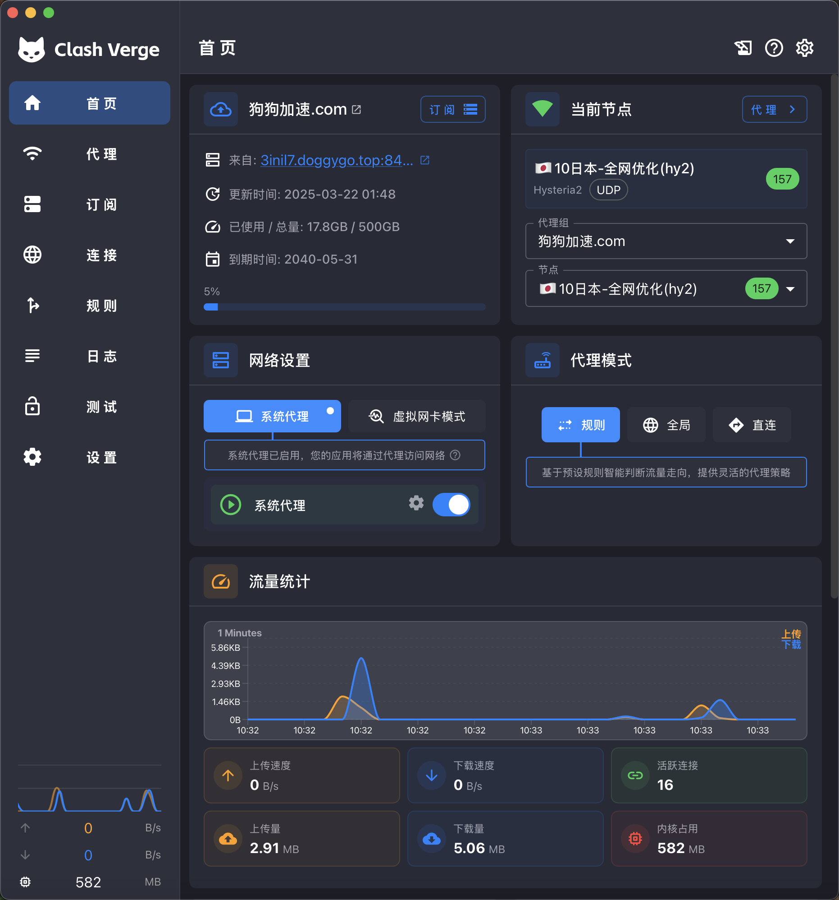
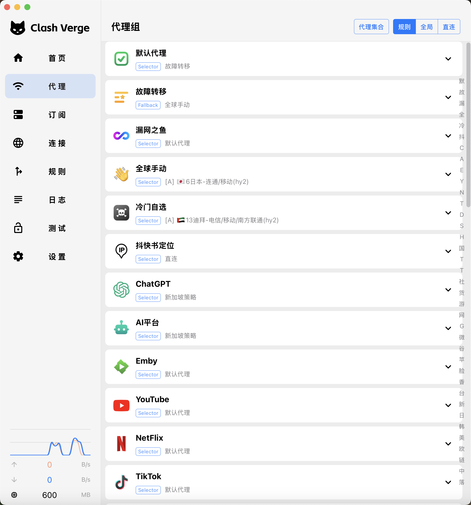

<h1 align="center">
  
  <br>
  Continuação do <a href="https://github.com/zzzgydi/clash-verge">Clash Verge</a>
  <br>
</h1>

<h3 align="center">
Uma interface gráfica para o Clash Meta construída com <a href="https://github.com/tauri-apps/tauri">Tauri</a>.
</h3>

<p align="center">
  Idiomas:
  <a href="./README_en.md">English</a> ·
  <a href="./README_es.md">Español</a> ·
  <a href="./README_fa.md">فارسی</a> ·
  <a href="./README_ja.md">日本語</a> ·
  <a href="./README_ko.md">한국어</a> ·
  <a href="./README_pt.md">Português</a> ·
  <a href="./README_ru.md">Русский</a> ·
  <a href="../README.md">简体中文</a>
</p>

## Pré-visualização

| Escuro                                 | Claro                                  |
| -------------------------------------- | -------------------------------------- |
|    |    |

## Instalação

Acesse a [página de lançamentos](https://github.com/clash-verge-rev/clash-verge-rev/releases) e baixe o instalador correspondente à sua plataforma.<br>
Oferecemos pacotes para Windows (x64/x86), Linux (x64/arm64) e macOS 10.15+ (Intel/Apple).

#### Como escolher o canal de lançamento

| Canal       | Descrição                                                                          | Link                                                                                   |
| :---------- | :--------------------------------------------------------------------------------- | :------------------------------------------------------------------------------------- |
| Stable      | Versões oficiais de alta confiabilidade, ideais para o uso diário.                 | [Release](https://github.com/clash-verge-rev/clash-verge-rev/releases)                 |
| Alpha (EOL) | Versões antigas usadas para validar o fluxo de publicação.                         | [Alpha](https://github.com/clash-verge-rev/clash-verge-rev/releases/tag/alpha)         |
| AutoBuild   | Versões contínuas para testes e feedback. Espere mudanças típicas de beta.         | [AutoBuild](https://github.com/clash-verge-rev/clash-verge-rev/releases/tag/autobuild) |

#### Guias de instalação e perguntas frequentes

Consulte a [documentação do projeto](https://clash-verge-rev.github.io/) para ver os passos de instalação, a solução de problemas e as perguntas frequentes.

### Canal do Telegram

Entre em [@clash_verge_rev](https://t.me/clash_verge_re) para acompanhar as novidades.

---

## Promoções

#### [Doggygo VPN — Acelerador global focado em desempenho](https://cvr.dginv.click/#/register?code=oaxsAGo6)

- Serviço internacional de alto desempenho com teste gratuito, planos com desconto, desbloqueio de streaming e suporte de primeira linha ao protocolo Hysteria.
- Cadastre-se pelo link exclusivo do Clash Verge e ganhe um teste de 3 dias com 1 GB de tráfego diário: [Cadastre-se](https://cvr.dginv.click/#/register?code=oaxsAGo6)
- Cupom exclusivo de 20% de desconto para usuários do Clash Verge: `verge20` (limitado a 500 usos)
- Plano promocional a partir de ¥15,8 por mês com 160 GB, mais 20% de desconto adicional no pagamento anual
- Equipe sediada no exterior para um serviço confiável, com até 50% de comissão compartilhada
- Clusters balanceados com rotas dedicadas de alta velocidade (compatíveis com clientes antigos), latência extremamente baixa, reprodução 4K sem travamentos
- Primeiro provedor global com **protocolo QUIC**, agora com protocolos da família QUIC mais rápidos (ideal para o cliente Clash Verge)
- Desbloqueia serviços de streaming e acesso ao ChatGPT
- Site oficial: [https://狗狗加速.com](https://cvr.dginv.click/#/register?code=oaxsAGo6)

### 🤖 [GPTKefu — Plataforma de atendimento ao cliente com IA integrada ao Crisp](https://gptkefu.com)

- 🧠 Compreensão profunda de todo o contexto da conversa + reconhecimento de imagens, com respostas profissionais e precisas de forma automática, sem respostas robóticas.
- ♾️ **Respostas ilimitadas**, sem preocupação com cotas — ao contrário de outros produtos de IA que cobram por mensagem.
- 💬 Consultas de pré-venda, suporte pós-venda, resolução de problemas complexos — cobre todos os cenários com facilidade, com casos reais comprovados.
- ⚡ Configuração em 3 minutos, sem curva de aprendizado — melhora na hora a eficiência e a satisfação do cliente.
- 🎁 Teste gratuito de 14 dias do plano Premium — experimente antes de pagar: 👉 [Testar grátis](https://gptkefu.com)
- 📢 Canal do Telegram do atendimento com IA: [@crisp_ai](https://t.me/crisp_ai)

---

## Funcionalidades

- Baseado em Rust de alto desempenho e no framework Tauri 2
- Inclui o núcleo integrado [Clash.Meta (mihomo)](https://github.com/MetaCubeX/mihomo) e permite trocar para o canal `Alpha`
- Interface limpa e elegante, com controles de cor do tema, ícones de grupos de proxy/bandeja e `CSS Injection`
- Gerenciamento avançado de perfis (ferramentas Merge e Script) com sugestões de sintaxe para as configurações
- Controle do proxy do sistema, modo guardião e suporte a `TUN` (adaptador de rede virtual)
- Editores visuais para nós e regras
- Backup e sincronização via WebDAV

### Perguntas frequentes

Acesse a [página de FAQ](https://clash-verge-rev.github.io/faq/windows.html) para ver instruções específicas por plataforma.

### Doações

[Apoie o desenvolvimento do Clash Verge Rev](https://github.com/sponsors/clash-verge-rev)

## Desenvolvimento

Consulte o [CONTRIBUTING.md](../CONTRIBUTING.md) para ver as diretrizes de contribuição.

Depois de instalar todos os pré-requisitos do **Tauri**, execute o ambiente de desenvolvimento com:

```shell
pnpm i
pnpm run prebuild
pnpm dev
```

## Contribuições

Issues e pull requests são bem-vindos.

## Agradecimentos

O Clash Verge Rev é baseado nos projetos a seguir, ou se inspira neles:

- [zzzgydi/clash-verge](https://github.com/zzzgydi/clash-verge): Interface gráfica para o Clash baseada em Tauri. Compatível com Windows, macOS e Linux.
- [tauri-apps/tauri](https://github.com/tauri-apps/tauri): Crie aplicativos de desktop menores, mais rápidos e mais seguros com um frontend web.
- [Dreamacro/clash](https://github.com/Dreamacro/clash): Túnel baseado em regras escrito em Go.
- [MetaCubeX/mihomo](https://github.com/MetaCubeX/mihomo): Túnel baseado em regras escrito em Go.
- [Fndroid/clash_for_windows_pkg](https://github.com/Fndroid/clash_for_windows_pkg): Interface do Clash para Windows e macOS.
- [vitejs/vite](https://github.com/vitejs/vite): Ferramentas de frontend de nova geração com uma experiência ultrarrápida.

## Licença

Licença GPL-3.0. Consulte o [arquivo de licença](../LICENSE) para mais detalhes.
